# TLS-CERTIFICATE Setup

## Prerequesite : IBM Cloud Account

## IBM Cloud Components needed
The project needs to have a secure website based on TLS encryption, hence https protocol is used, this latter needs a valid and up-to-date certificate.

1. **IBM Certificate Manager** is used to store and to manage the certificate
2. IBM Certificate Manager check expiration date and if needed call a webhook **Function Service** to renew the certificate
3. A certificate is generated for a domain name, this one is handled by **IBM Cloud Internet Service**, the domain registrar is handle by **IBM Cloud Domain Name Service**.

## IBM Cloud Domain Name Service
You may register a new domain [**here**](https://cloud.ibm.com/catalog/infrastructure/domain_registration).

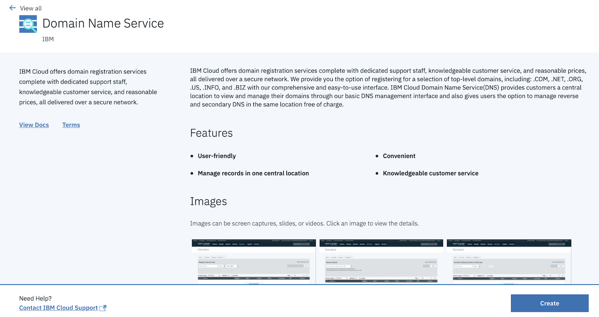

Click on **CREATE**.

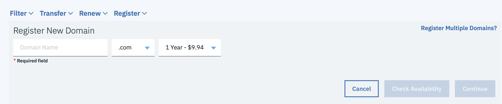
Provide a domain name, the price may change depending on the extension (.com, .net, .org, ...) and the number of years chosen.

You may click on **Check Availability** to check whether or not the domain name provided is available.

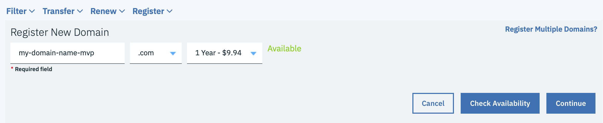

You may proceed by clicking on **Continue** if your domain name is available

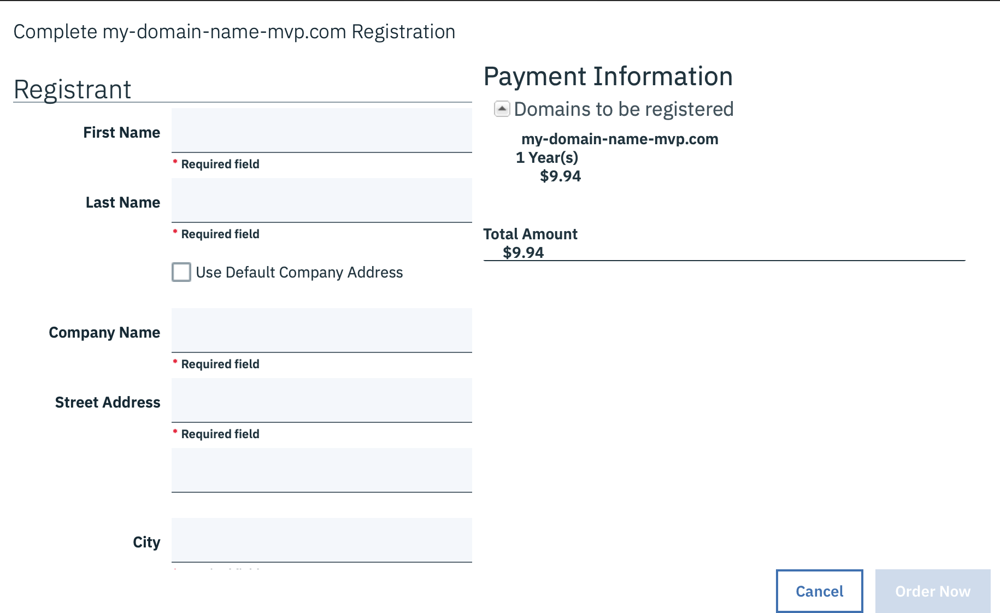
Fill up the form and take care about the email address which will be used to validate your purchase.
Click on **Order Now** to validate the process.

After clicking on the link in the mail sent to your mailbox, you should have valid domain name such as follows after a few minutes :
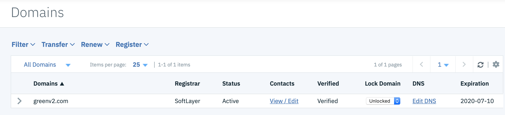

## IBM Cloud Internet Service (CIS)
You may create an IBM CIS instance [here](https://cloud.ibm.com/catalog/services/internet-services).

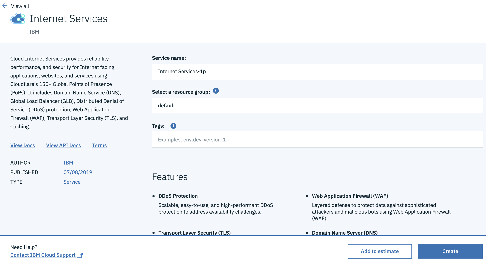
Click on **CREATE**.

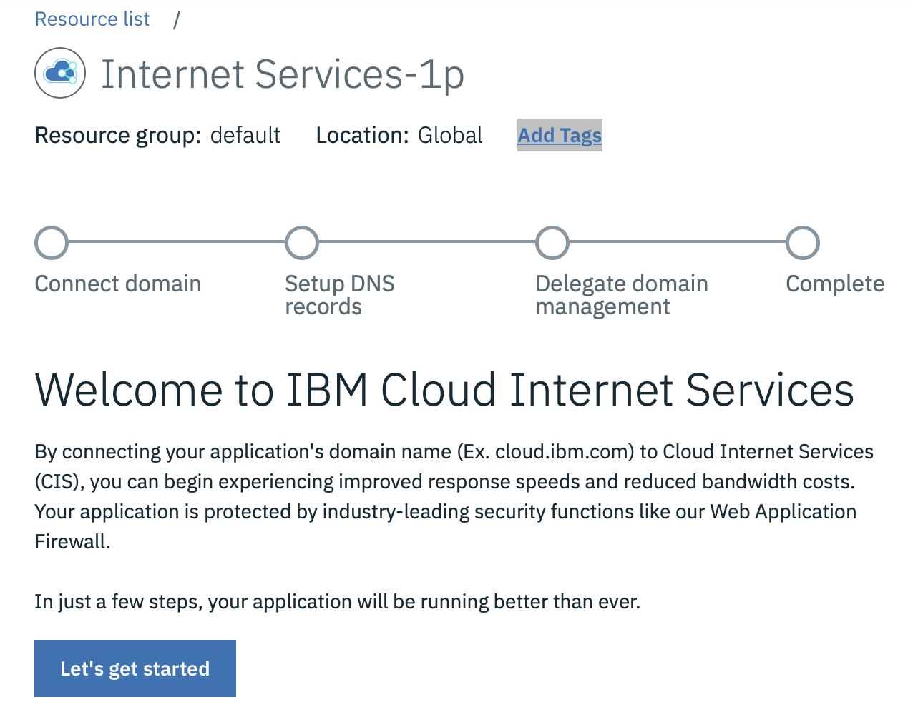
Click on **Let's get started**.

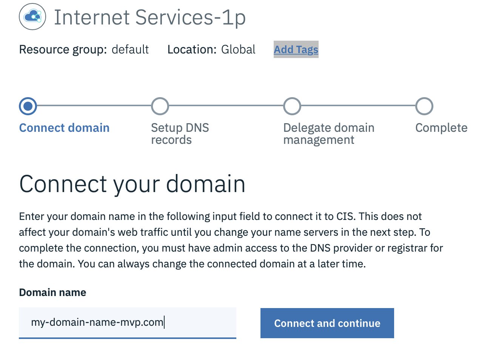
Provided the domain name you created on the previous stage and Click on **Connect and continue**.

The system will automatically detect the NameServers attached by default (your registrar setup) to your domain, and proposed a list of CIS NameServers to replace, for instance :

`ns1.softlayer.com -> ns015.name.cloud.ibm.com`
`ns2.softlayer.com -> ns016.name.cloud.ibm.com`

You need to go back your **Domain Registration** sub-menu from the **Classic Infrastructure** menu
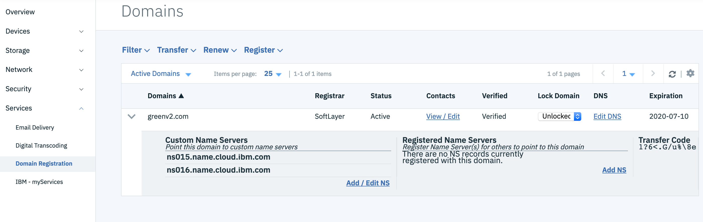
Click on **Add /Edit NS** link of your domain and change the list of NameServers accordingly to the CIS demands.

After a few minutes, you CIS instance will integrate your domain (`Active`).
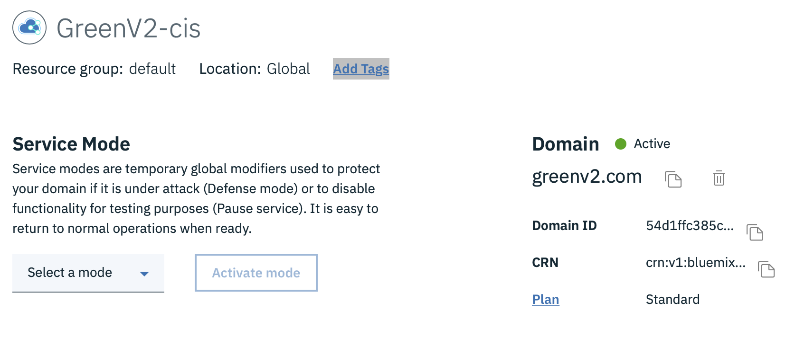

You need to redirect a subdomain such as **www**.greenv2.com to your Ingress Public IP address, create an 'A' entry just as shown below.
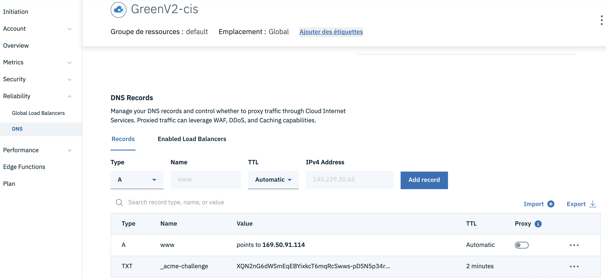

Tick on **proxy** just as shown below to benefit from **IBM CIS caching**
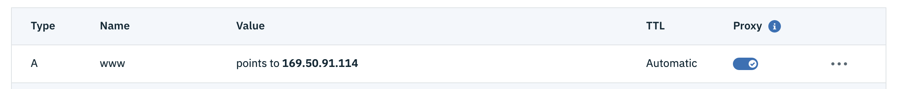

## IBM Cloud Function
**IBM Cloud Certificate Manager** needs a webhook to call on an event such as certificate expiration or certification renewal. This is done by calling a function, fortunately the IBM documentation points out a github [link](https://github.com/ibm-cloud-security/certificate-manager-domain-validation-cloud-function-sample) which shows a predefined piece of code in javascript to implement the integration between **IBM Cloud Certificate Manager** and **IBM Cloud Function**.
The code used for greenv2 project is [here](../code/function/main.js).

Here is a few screenshot that is not presented in the link when configuring the function especially regarding the parameters.

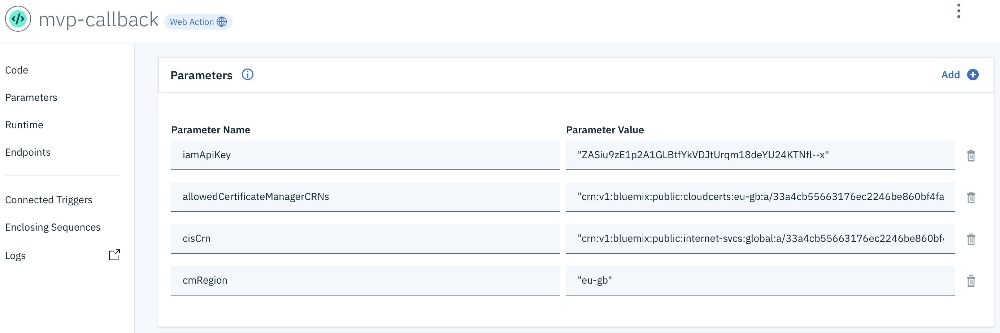

`iamApiKey`
The easiest way to have this one is to go the Access(IAM) menu
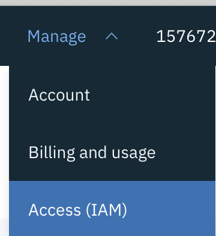

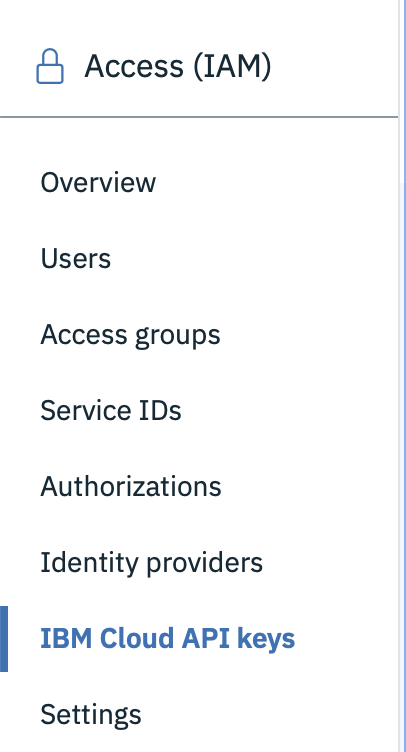
And click on **IBM Cloud API keys** and then **Create an IBM Cloud API key**

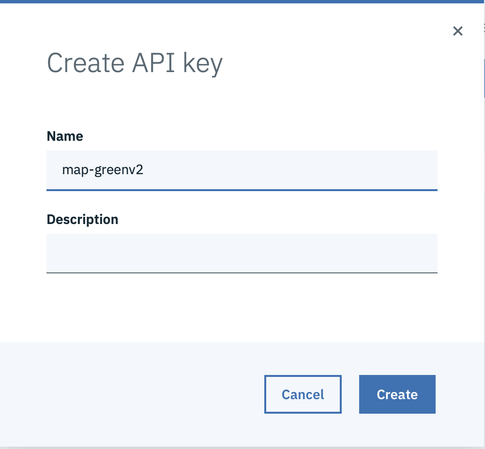

Provide a name an click on **Create**

You will be given a one-time-only view of the key

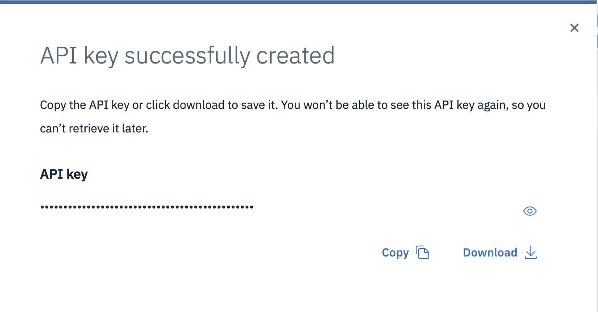

Copy and paste it to the iamApiKey parameter of the function.
I might download it to a file to have a backup of the key somewhere else.
IBM Cloud will never show that key again after closing this window.

`allowedCertificateManagerCRNs`
Actually, we skipped this one by commenting the first check in the main function.

`cisCrn`
This parameter may be retrieved in the overview of your CIS instance.
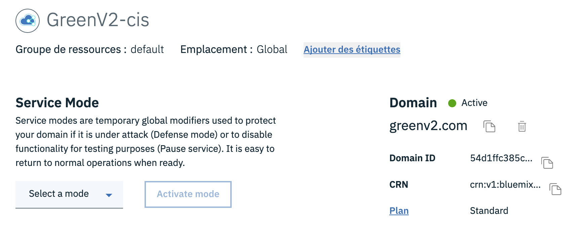

`cmRegion`
This parameter is used to determine the Region endpoint of your CIS.
It should be :

	- eu-gb for London
	- eu-de for Francfort
	... 

## IBM Cloud Certificate Manager
Create your **IBM Cloud Certificate Manager** instance [here](https://cloud.ibm.com/catalog/services/certificate-manager).
 
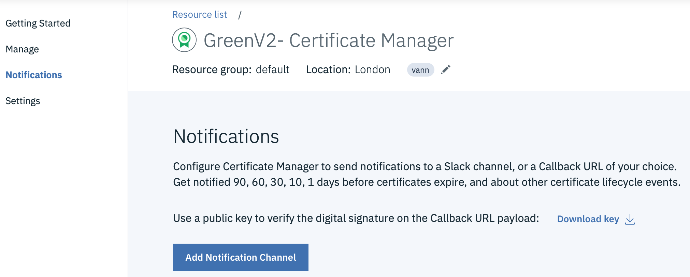
Go to **Notifications** and Click on **Add Notification Channel**.

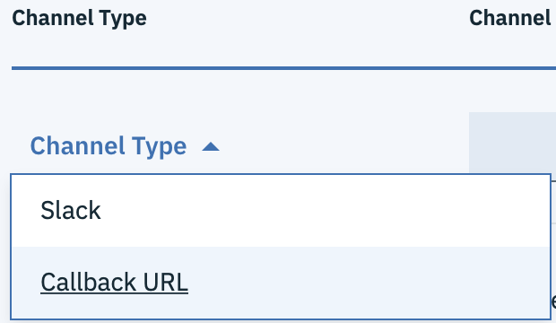
Select **Callback URL** and paste to the **Channel Endpoint** the URL pasted from the function created (see below) and click on **Save**.

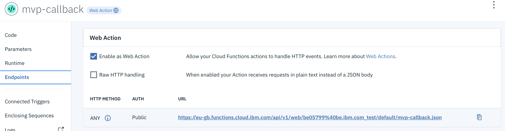

You may click on **Test connection** to check if your URL is correct.

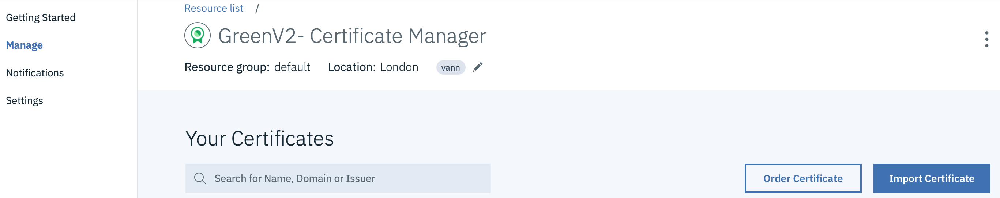

Then go to **Manage** menu and click on **Order Certificate**

Click on **I'm using Cloud Internet Services**

Then, give it a name and choose the CIS instance and choose **Wildcard certificate**
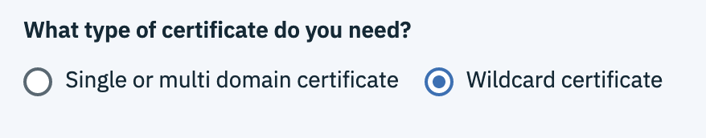
This will enable the certificate for all subdomain **\*.yourdomain.com**.

Click on **Order**.

After a few seconds, you should have a valid certificate for 90 days.
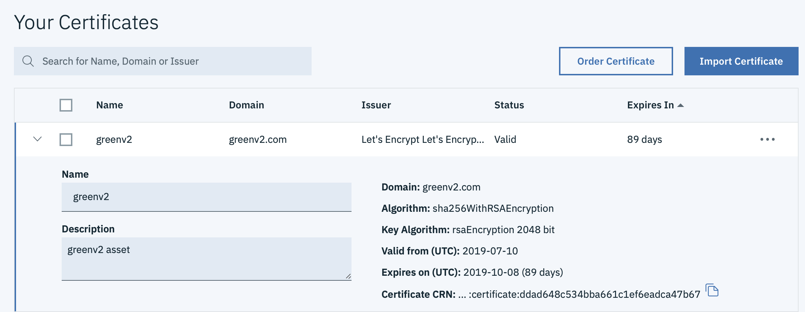

