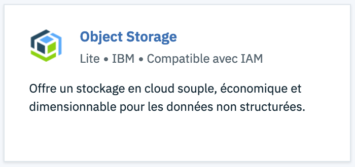
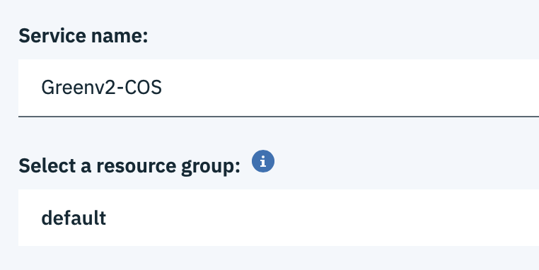
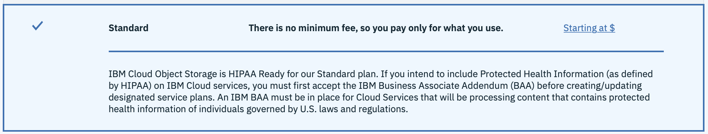
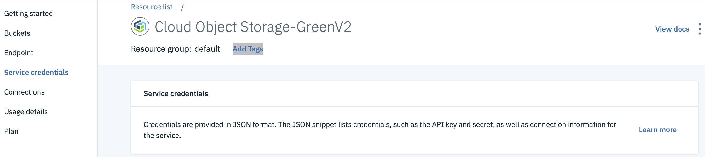
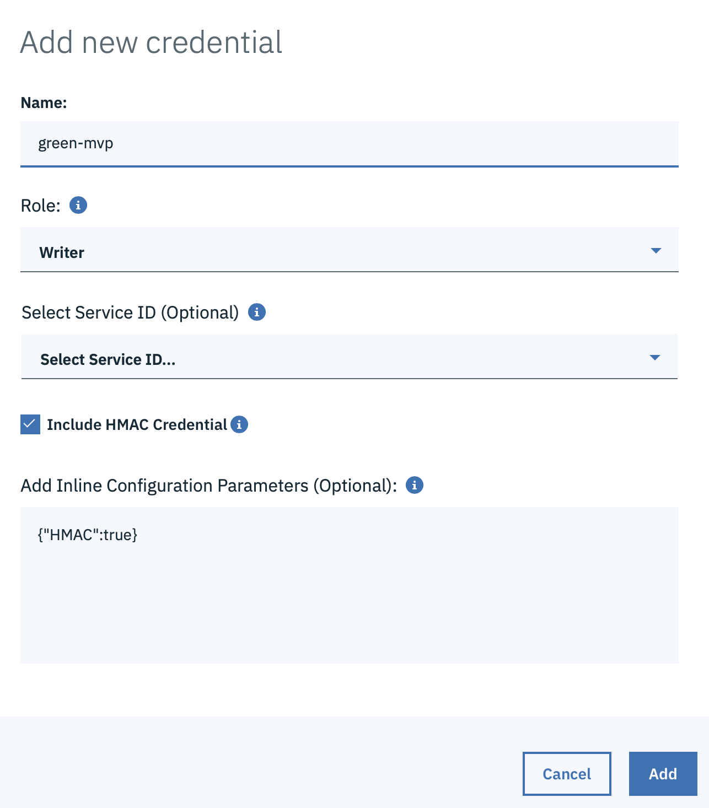
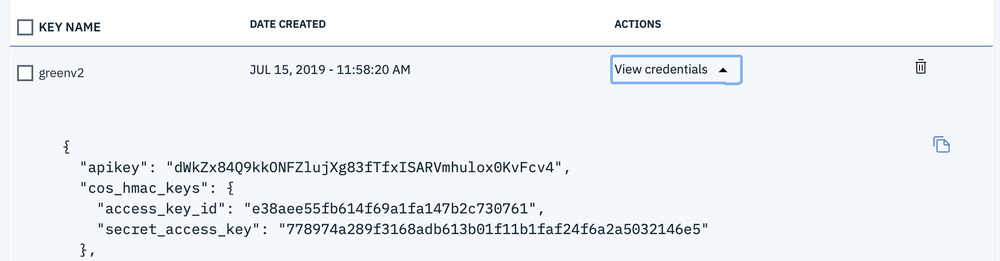
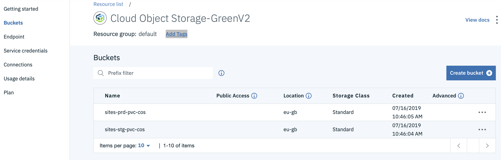
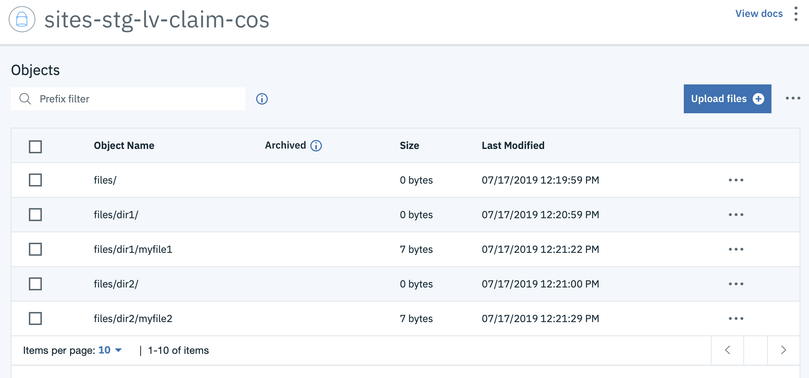

# Drupal on IBM Cloud Object Storage

Guide to all available configuration settings.

---

## IKS integration with IBM Cloud Object Storage
**[Follow the instructions in this link to setup your IKS instance](https://cloud.ibm.com/docs/containers?topic=containers-object_storage)**

This documentation will essential create all the needed `storageClass` in your **IKS** instance to address all kind of **IBM Cloud Object Storage** offerings. At the end of the procedure, you will have this :

```
kubernetes$ kubectl get storageClass 
NAME                                   PROVISIONER        AGE
default                                ibm.io/ibmc-file   27d
ibmc-file-bronze (default)             ibm.io/ibmc-file   27d
ibmc-file-custom                       ibm.io/ibmc-file   27d
ibmc-file-gold                         ibm.io/ibmc-file   27d
ibmc-file-retain-bronze                ibm.io/ibmc-file   27d
ibmc-file-retain-custom                ibm.io/ibmc-file   27d
ibmc-file-retain-gold                  ibm.io/ibmc-file   27d
ibmc-file-retain-silver                ibm.io/ibmc-file   27d
ibmc-file-silver                       ibm.io/ibmc-file   27d
ibmc-s3fs-cold-cross-region            ibm.io/ibmc-s3fs   23h
ibmc-s3fs-cold-regional                ibm.io/ibmc-s3fs   23h
ibmc-s3fs-flex-cross-region            ibm.io/ibmc-s3fs   23h
ibmc-s3fs-flex-perf-cross-region       ibm.io/ibmc-s3fs   23h
ibmc-s3fs-flex-perf-regional           ibm.io/ibmc-s3fs   23h
ibmc-s3fs-flex-regional                ibm.io/ibmc-s3fs   23h
ibmc-s3fs-standard-cross-region        ibm.io/ibmc-s3fs   23h
ibmc-s3fs-standard-perf-cross-region   ibm.io/ibmc-s3fs   23h
ibmc-s3fs-standard-perf-regional       ibm.io/ibmc-s3fs   23h
ibmc-s3fs-standard-regional            ibm.io/ibmc-s3fs   23h
ibmc-s3fs-vault-cross-region           ibm.io/ibmc-s3fs   23h
ibmc-s3fs-vault-regional               ibm.io/ibmc-s3fs   23h
```

Focusing on ibmc-s3fs-**XXXX**-\<perf-\>**YYYY** storage classes only :

XXXX : **standard**, **vault**, **cold**, **flex** are the four IBM COS storage offering.

  - **standard** : this option should be used when few data are stored especially for development environment or even for some AI usage when the overall data is read many times.
  - **cold** : this option should be used when few data reads occurred (actually less than 14% of total storage per month) especially for archives or backups.
  - **vault** : is a trade-off between standard and cold (more than 14% and less than 100% of total storage reads per month)
  - **flex** : this option should be used when the client do not know how its data are used, the costs are eventually capped if necessary

Optional **perf** value means the usage of **IBM Aspera** to boost your data transfer. This is especially efficient on bad public network.

YYYY : **cross-region**, **regional** determined the resiliency of the data, **cross-region** is at the regional failure level, **regional** is at the Availability Zone failure level.
  
  - **cross-region** : give the ability for **all** of our custumers to retrieve a **hundred** percent of their data even of any **regional** breakdown (even if a whole region is burnt to the ground). In Europe, IBM Cloud Object Storage **Cross Region offering** is spread into **Amsterdam, Francfort and Milan** datacenters.
  
  - **regional** : give the ability for **all** of our custumers to retrieve a **hundred** percent of their data even of any **availability zone** breakdown (even if a whole region is burnt to the ground). In Europe, IBM Cloud Object Storage **Regional offering** is either **London** or **Francfort** MZR (Multi-Zone Region).

These storage classes may be used in your kubernetes instance **Persistence Volume Claim (PVC)**, you don't need to create a **Persistance Volume**, this latter is automatically created when a PVC of these **ibmc-s3fs-XXXX-YYYY** types are created. When deleting a PVC, the PV is also deleted automatically as well.


## IBM Cloud Object Storage usage in Drupal container

### Kubernetes secret to connect to IBM Cloud account

Before creating your kubernetes PVC, you need to create a kubernete secret, so that the  **ibmc-s3fs-XXXX-YYYY** storage class driver is able to connect to the right IBM Cloud account. You may use either a combination of (**API Key + COS ID instance**) or the standard S3 combination (**access key id + secret access key**). The first one allows you to have more control on privileges because it is based on **IAM**.

Here is an exemple of the kubectl command to create the secret based on the standard S3 combination :
```
kubectl create secret generic <secret_name> --type=ibm/ibmc-s3fs --from-literal=access-key=<access_key_id> --from-literal=secret-key=<secret_access_key>
```

 - secret\_name : specify a **secret** name
 - access\_key\_id : provide the hmac **access\_key\_id** value
 - secret\_access\_key : provide the hmac **secret\_access\_key** value

### How to get those details from IBM COS ?
#### Create your IBM Cloud Object Storage instance
 Search in the IBM Cloud catalog this item and click on it.
 
 
 
Provide a **name**, a **resource group**, choose the **standard plan** and click on `create`
 
 
 
 
Go to **Service credentials** and click on `new credential`



Provide a **name**, choose **writer** role, tick on **Include HMAC credential** {"HMAC":true} appears in the optional parameters pane, then click `add`



Click on `View credentials`


You may now copied either the **apikey** or the couple **access\_key\_id/secret\_access\_key**. In our example above, we use this latter.

### Kubernetes ClusterRole for IBM Cloud Object Storage Driver
You need to create a Kubernetes ClusterRole named ***ibmcloud-object-storage-secret-reader*** including your secret
Here is the yaml file needed :


```
kind: ClusterRole
apiVersion: rbac.authorization.k8s.io/v1beta1
metadata:
  name: ibmcloud-object-storage-secret-reader
rules:
- apiGroups: [""]
  resources: ["secrets"]
  resourceNames: ["<secret_name>"]
  verbs: ["get"]
```
Put your secret name in the resourceNames, you may put a list of secret names if needed.

### Create a Kubernetes PVC
You may now be able to create a Kubernetes PVC based on IBM Cloud Object Storage bucket.
Use the following yaml file to create your Kubernetes PVC :

```
---
apiVersion: v1
kind: PersistentVolumeClaim
metadata:
  name: <pvc name>
  annotations:
    ibm.io/auto-create-bucket: "true"
    ibm.io/auto-delete-bucket: "false"
    ibm.io/bucket: "<bucket name>"
    ibm.io/secret-name: "<secret name>"
    ibm.io/endpoint: "https://s3.private.eu-gb.cloud-object-storage.appdomain.cloud"
spec:
  accessModes:
    - ReadWriteMany
  storageClassName: ibmc-s3fs-standard-regional
  resources:
    requests:
      storage: 100Gi # could be any number
```

- pvc name: provide your Kubernetes PVC name here in order to claim it in a pod
- bucket name: provide a bucket name, this bucket will appear in your IBM Cloud COS instance. Choose a long name because it has to be unique within all the existing bucket of the same region (including all other client buckets)
- secret name : provide your secret name you created before.

Notice that the size of the storage is compulsory but its value has no sense, as the IBM Cloud COS bucket has no volume limitation.

FI : a bucket may have up to 2^128 objects and an object may be up to 10 TB size.

You may check your IBM Cloud COS PVC

```
kubernetes$ kubectl get pvc | grep ibmc-s3fs
sites-prd-pvc-cos    Bound    pvc-24323d88-a7a6-11e9-9ed4-6657bd2680ff   100Gi      RWX            ibmc-s3fs-standard-regional   23h
sites-stg-pvc-cos    Bound    pvc-24298a3a-a7a6-11e9-9ed4-6657bd2680ff   100Gi      RWX            ibmc-s3fs-standard-regional   23h
```

### Use your Kubernetes PVC in your Kubernetes Drupal pod
Specify a mount path in your pod spec:

```
          volumeMounts:
            - mountPath: /var/www/drupal/web/sites/default
              name: sites-cos-storage
              readOnly: false

```
And specify you PVC name

```
      volumes:
        - name: sites-cos-storage
          persistentVolumeClaim:
            claimName: <pvc name>

```
Actually, the Drupal container try at startup to change the owner of the ***/var/www/drupal/web/sites/default/files*** directory.
thus the ***files*** sub directory should exist before this action, otherwise the container will fail.
You need then to initiate an initContainer who mount the same directory and create the ***files*** sub directory in the event this one do not exist.

```
      initContainers:
        - image: "uk.icr.io/greenv2-ns/code-php-fpm:latest"
          volumeMounts:
            - mountPath: /var/www/drupal/web/sites/default
              name: sites-cos-storage
              readOnly: false
          name: create-files
          command: [ "sh", "-c", "mkdir -p /var/www/drupal/web/sites/default/files" ]
          securityContext:
            runAsUser: 0

```

Then any file or diretory created in the ***/var/www/drupal/web/sites/default*** sub directory will create an object in the specified IBM COS bucket

Here is an example of two PVC created which trigger the create of two buckets:



The following example shows how COS is organized via the ibmc-s3fs driver:

```
root@php-fpm-stg-d5bb47bfb-j6hqk:/var/www/drupal/web/sites/default# ls -lR
.:
total 1
drwxrwxrwx 1 www-data www-data 0 Jul 17 10:19 files

./files:
total 1
drwxr-xr-x 1 root root 0 Jul 17 10:20 dir1
drwxr-xr-x 1 root root 0 Jul 17 10:21 dir2

./files/dir1:
total 1
-rw-r--r-- 1 root root 7 Jul 17 10:21 myfile1

./files/dir2:
total 1
-rw-r--r-- 1 root root 7 Jul 17 10:21 myfile2

```

Each directory (files, dir1, dir2) has an entry in the bucket

Each file (myfile1, myfile2) has also an entry in the bucket



