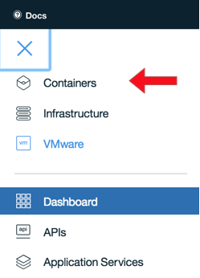
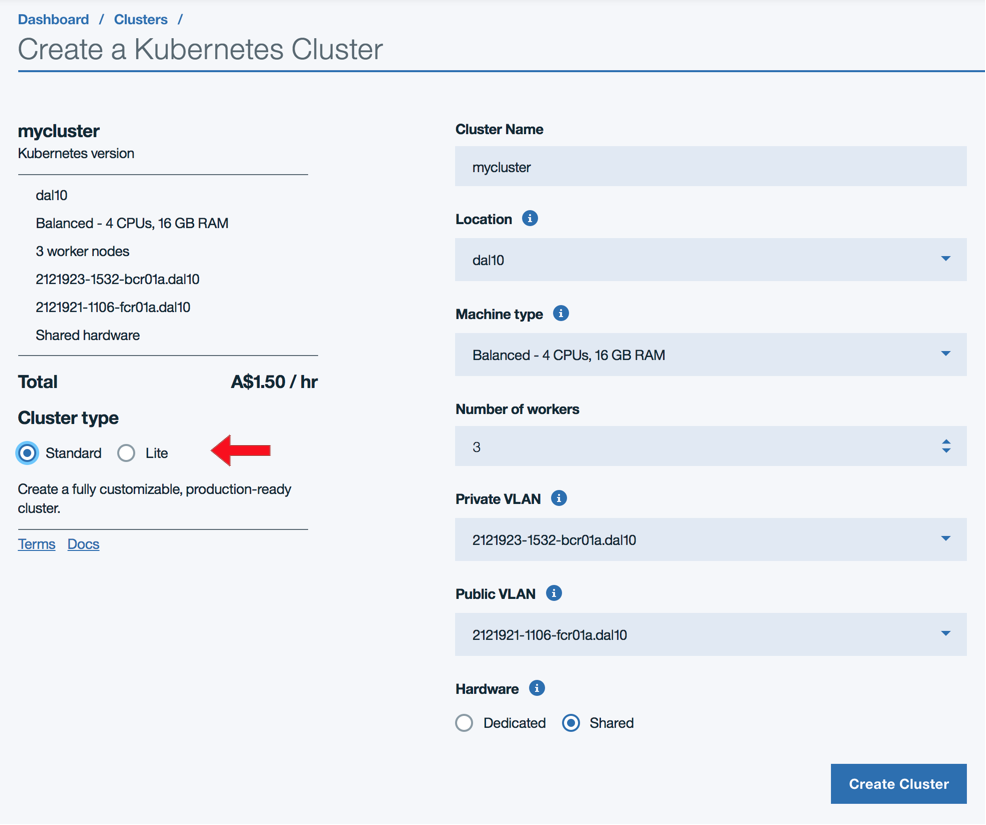
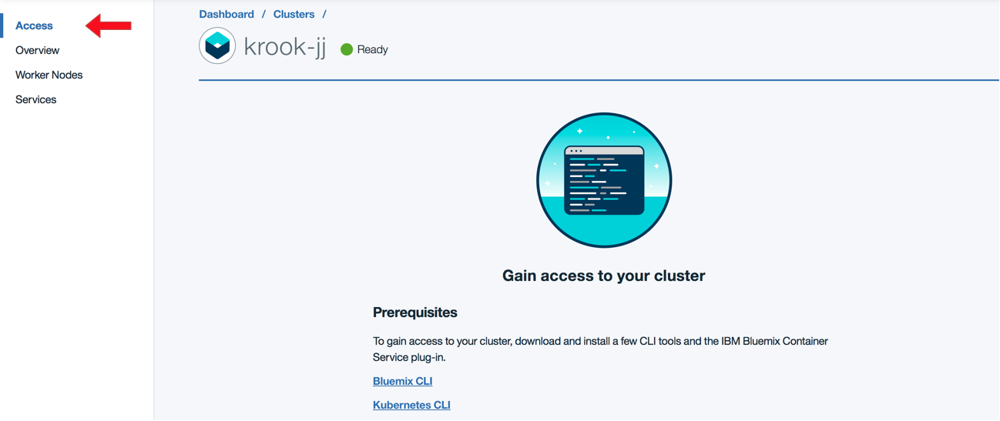
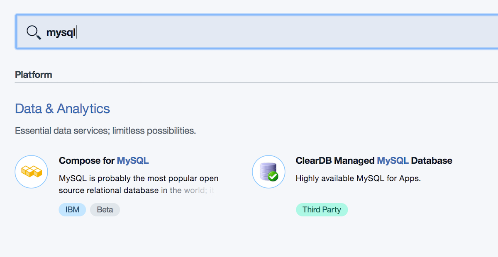
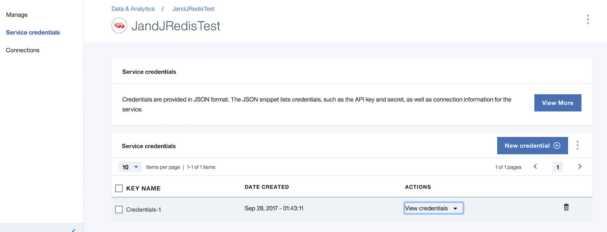
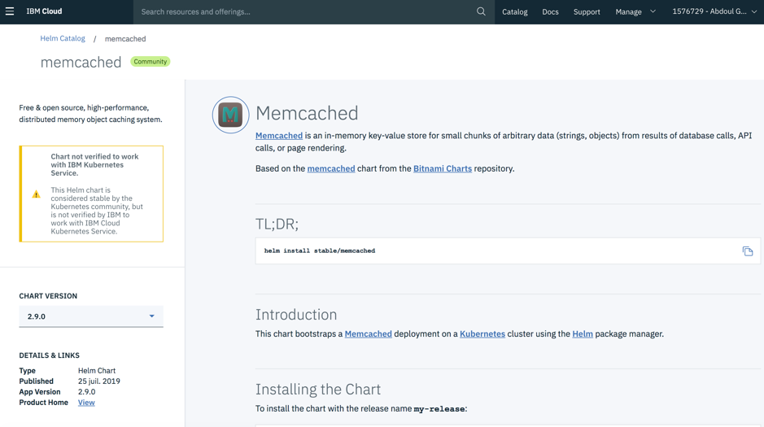
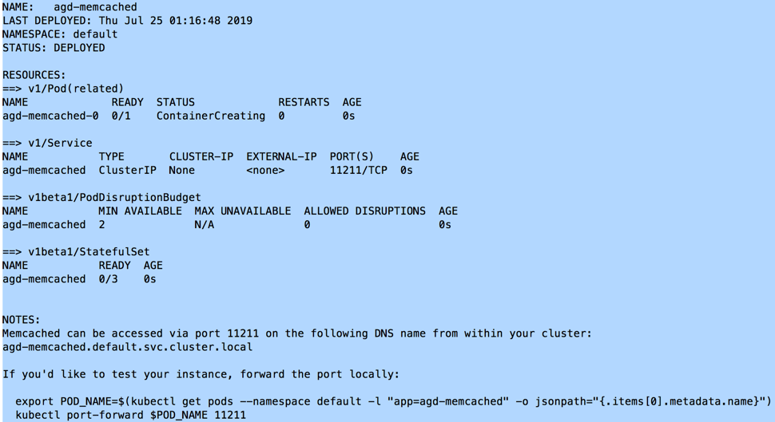

# Initial Setup

Guide to all available configuration settings.

---

## Provision a Kubernetes cluster on the IBM Cloud Container Service
- Create a paid IBM Cloud account, and log into the dashboard.
- Choose Containers from the left hand hamburger navigation.

    

- Click the Create cluster button.

    

- Select the Standard pay-as-you-go type of cluster (this allows for storage volumes and public floating IPs) and Create.

    

- Going back to the Dashboard from the navigation, you'll see your cluster.

- Click on it to see the cluster Overview.

    

- Click on Worker Nodes to get details on your worker nodes.

    

- It will take time for the cluster to complete provisioning, so go get some coffee.

## Connect to your Kubernetes cluster from your workstation
- Click on the Access link to download and configure the `bx` and `kubectl` CLIs. `kubectl` version >=1.7.6 is required.

    

- Run the configuration commands, making sure that the `$KUBECONFIG` variable path is indeed correct (it may not reflect your actual home directory).
- You can then use `kubectl` or the `kubectl proxy` dashboard web UI that starts on localhost to inspect your Kubernetes environment.

## Provision and bind two MySQL-as-a-Service instances
- You can do this with the `bx` command too, but I prefer to work with the dashboard as it's just a one time setup operation with several options to browse through.
- Go to the hamburger navigation again and choose Data & Analytics.

    

- Click "Create"

    

- You have a choice of two MySQL-as-a-Service providers, Compose and ClearDB. ClearDB is quicker to get running with for a PoC. You can use the free plan, but if you need better performance, choose a paid plan.

    

- Take note of the credentials, and save them in a `scripts/kubernetes/secrets/service-credentials.txt` file you copy from [`scripts/kubernetes/secrets/service-credentials.txt.tpl`](../scripts/kubernetes/secrets/service-credentials.txt.tpl). There are variables for both a "Staging" database instance and a "Production" instance. They will be separate databases with separate credentials.

For ClearDB, the credentials can be found in the ClearDB Dashboard. Select your database and click the "System Information" tab
    

For Compose, the credentials will be shown right before you create the service.
    

- The IBM Cloud Container Service offers a way to autobind credentials, but using a secret from this credentials file gives us the option to use services in another organization and space and/or start it up later as its own pod.

- Repeat these steps to create a second database and make sure you have entries for both in the `scripts/kubernetes/secrets/service-credentials.txt` file.

## Provision and bind a Redis-as-a-Service
- You can do this with the `bx` command too, but I prefer to work with the dashboard as it's a one time setup operation with several options.
- Go to the hamburger navigation again and choose Data & Analytics.

    

- Click "Create"

    

- You have a choice of two Redis-as-a-Service providers, Compose and Redis Cloud. Redis Cloud has a free tier, so you can just use that. 

    

- Take note of the credentials, and save them in `scripts/kubernetes/secrets/service-credentials.txt`.

- For Compose, the credentials can be found by selecting the service from the dasboard, and clicking "Service Credentials"

    

## Provision a Memcached instance

 There is currently no cloud foundry service on IBM Cloud for Memcached.

 As an alternative we’ll deploy the Memcached helm chart available to deploy on IKS cluster.

 From the menu on the top left, select Kubernetes -> Helm Catalog and filter with ex: memca to see the available charts.
 
 
  ! 
      
      
 Select Memcached v2.9.0 
 
   
   
   
 In order to install the chart, follow the below instructions
helm:

cd ~
wget https://kubernetes-helm.storage.googleapis.com/helm-v2.14.0-linux-amd64.tar.gz

mkdir helm-v2.14.0
tar zxfv helm-v2.14.0-linux-amd64.tar.gz -C helm-v2.14.0

export PATH="$(echo ~)/helm-v2.14.0/linux-amd64:$PATH"

helm init

kubectl create serviceaccount --namespace kube-system tiller
kubectl create clusterrolebinding tiller-cluster-rule --clusterrole=cluster-admin --serviceaccount=kube-system:tiller
kubectl patch deploy --namespace kube-system tiller-deploy -p '{"spec":{"template":{"spec":{"serviceAccount":"tiller"}}}}'

helm repo add bitnami https://charts.bitnami.com/bitnami

helm install bitnami/memcached -name agd-memcached

   

