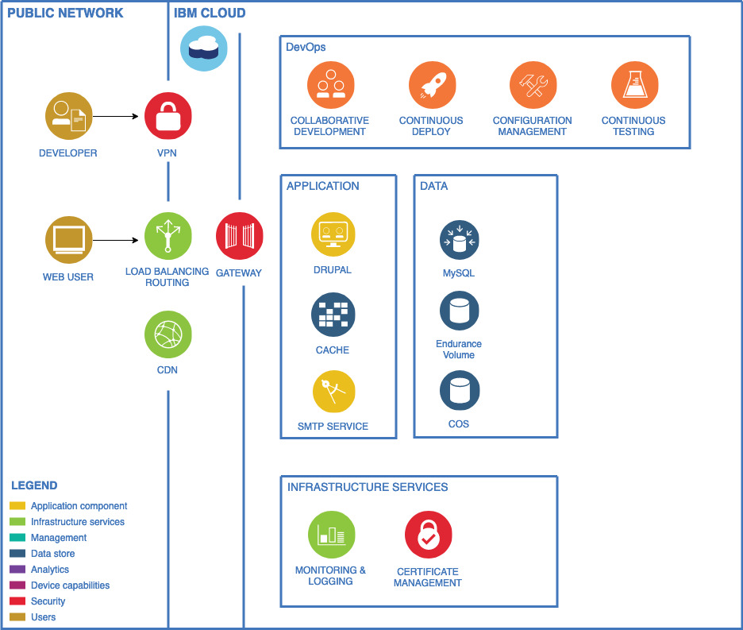
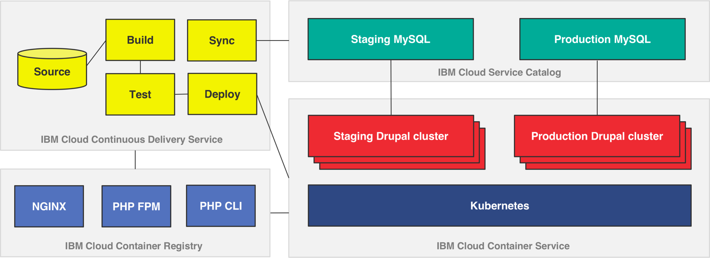

# Greenv2

Project documentation with&nbsp;Markdown.

---

## Project Context

- Client requires CMS-as-a-Service
- Drupal is the CMS technology of choice
- Many competitors in this space; mostly open source
- With CMS-aaS we must provide a DevOps solution
- Dependencies with Drupal: LAMP stack and Caching
- End goal: To provide the fastest solution to get new content into Production

## Functional requirements

Separate environments for: 

- Dev; Test; Production;
- Site must be hosted on public cloud;
- Site must be accessible globally;
- Code deployment can be done using FTP/SFTP;
- Content distribution using CDN;
- SMTP setup to facilitate email communication to support “Contact Us” function in the website;

## Non-functional requirements

Security:

- Enterprise grade firewalling;
- DDOS protection;
- Availability:
- High Availability of the infrastructure platform;

Scalability:

- Scalable infrastructure with possible future expansion of the website.
- Infrastructure support for services around DNS mapping and Certificate installation.

## Logical architecture

## Landscape diagram of the services used
When custom code is checked into this repository, it triggers a Docker image build which stores the images into a private container registry that analyzes the security of the images. These images are then rolled out across the Kubernetes cluster through staging and production gates. Data from production can be synchronized back to staging to ensure the environments are as close as possible.

## Setup the environment and deploy the cluster

### One time Container Service and Cloud data services setup
See the Container Service Kubernetes and IBM Cloud services (MySQL, Redis, Memcached) [configuration instructions](docs/INITIAL-SETUP.md).

### Building and deploying the first set of containers
See the Docker container build and Kubernetes deployment [instructions](docs/DEPLOY-CONTAINERS.md).

### Ongoing development and operations with GitHub commits
See the ongoing development [instructions](docs/ONGOING-DEVELOPMENT.md). And the work in progress DevOps [pipeline docs](docs/PIPELINE-SETUP.md). This shows how container images are rebuilt and how to address security issues detected by the IBM Vulnerability Advisor.

### Synchronizing data from production back to staging
There are two [synchronization scripts](docs/SYNCHRONIZING-DATA.md) that can be invoked to bring user generated changes to files or data from production back into the staging environment. You can also execute other scripts inside the containers as well.

### Security
The web site uses TLS certificate to secure the data transfer. The domain is provided by [IBM Cloud Domain name Service](https://cloud.ibm.com/catalog/infrastructure/domain_registration) and it is managed by [IBM Cloud Internet Service aka CIS](https://cloud.ibm.com/catalog/services/internet-services). [IBM Certificate Manager](https://cloud.ibm.com/catalog/services/certificate-manager) store the certificate and has the ability to keep track of the expiration date of the certificate. IBM Certificate Manager is able to renew automatically the certificate before its expiration date. IBM Certificate Manager uses a webhook to an [IBM Function](https://cloud.ibm.com/openwhisk/) (serverless) with a smart small code to renew the certificate. 

### License
[Apache 2.0](LICENSE.txt)
